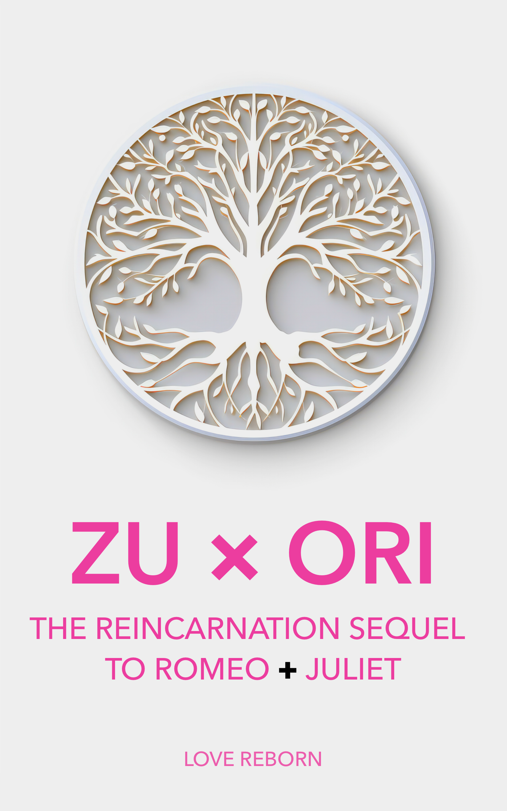

<h1>
  
  ZU × ORI Images Repository
</h1>

This repository contains the official visual assets for the world of **ZU × ORI** — a reincarnation-era sequel to *Romeo and Juliet*, told through memory, mystery, and love.

These images define the visual identity of ZU × ORI and are provided as open, shareable materials.

Images include:
- **Covers**  
- **Character Posters**  
- **ZU × ORI Logos**  

---

### Covers

  

<em>Cover: Ensemble</em>

---

  

<em>Cover: Classic</em>

---

### Logos

  

<em>Logo Greyscale</em>

---

  

<em>Logo Pink </em>

---

## 🌱 About ZU × ORI

**ZU × ORI** is a mythic narrative told across lifetimes — a reincarnation-era sequel to *Romeo and Juliet*, unfolding through memory, mystery, and the re-writing of fate.

This repository is part of the wider [ZU × ORI universe](https://github.com/zuxori), which includes research, story episodes, visual assets, and conceptual threads meant to be explored and expanded.

---

## 🪶 Usage & Attribution

These images are offered freely. You may use, remix, or share them however you like — no permission needed and no attribution required.

If you **want** to credit or connect back, we’d be honored:
> `"ZU × ORI" (zuxori.com) — from the open image archive`

If you build something cool, we’d love to see it.

---

*“Some images arrive before the story. Some outlast it.”*
